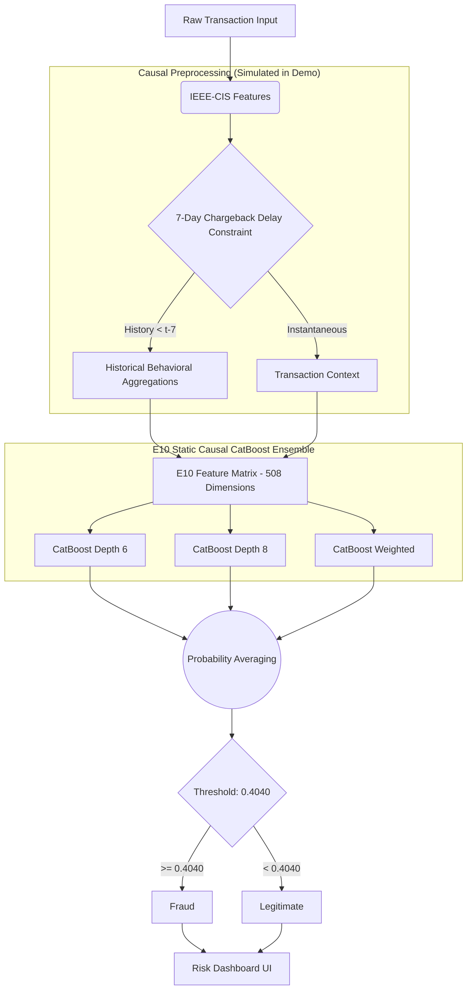

# System Architecture

```mermaid
graph TD
    A[Raw Transaction Input] --> B(IEEE-CIS Features)
    
    subgraph "Causal Preprocessing (Simulated in Demo)"
        B --> C{7-Day Chargeback Delay Constraint}
        C -->|History < t-7| D[Historical Behavioral Aggregations]
        C -->|Instantaneous| E[Transaction Context]
    end
    
    D --> F[E10 Feature Matrix - 508 Dimensions]
    E --> F
    
    subgraph "E10 Static Causal CatBoost Ensemble"
        F --> G1[CatBoost Depth 6]
        F --> G2[CatBoost Depth 8]
        F --> G3[CatBoost Weighted]
    end
    
    G1 --> H((Probability Averaging))
    G2 --> H
    G3 --> H
    
    H --> I{Threshold: 0.4040}
    
    I -->|>= 0.4040| J[Fraud]
    I -->|< 0.4040| K[Legitimate]
    
    J --> L[Risk Dashboard UI]
    K --> L
```
