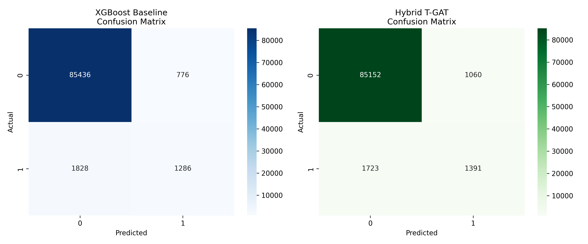

# Final Test Evaluation Report

## Protocol
- **Dataset:** IEEE-CIS Credit Card Fraud
- **Test Split:** Untouched Days 151-182
- **Test Samples:** 89326
- **Fraud Samples:** 3114
- **Causality:** {history} < t_{target}$ strictly enforced.
- **Thresholds:** Frozen from Validation split.
- **XGBoost Threshold:** 0.2800
- **Hybrid Threshold:** 0.2200

## Results Summary

| Metric | XGBoost Baseline | Hybrid T-GAT | Absolute Change | Relative Change |
| :--- | :--- | :--- | :--- | :--- |
| **F1 Score** | 0.4969 | 0.4999 | +0.0030 | +0.60% |
| **AUPRC** | 0.4954 | 0.5002 | +0.0048 | +0.97% |
| **AUROC** | 0.8932 | 0.8903 | -0.0029 | -0.33% |
| **FPR** | 0.0090 | 0.0123 | +0.0033 | +36.60% |
| **Precision** | 0.6237 | 0.5675 | - | - |
| **Recall** | 0.4130 | 0.4467 | - | - |

## Confusion Matrices
**XGBoost:**
TP: 1286 | FP: 776
FN: 1828 | TN: 85436

**Hybrid T-GAT:**
TP: 1391 | FP: 1060
FN: 1723 | TN: 85152

